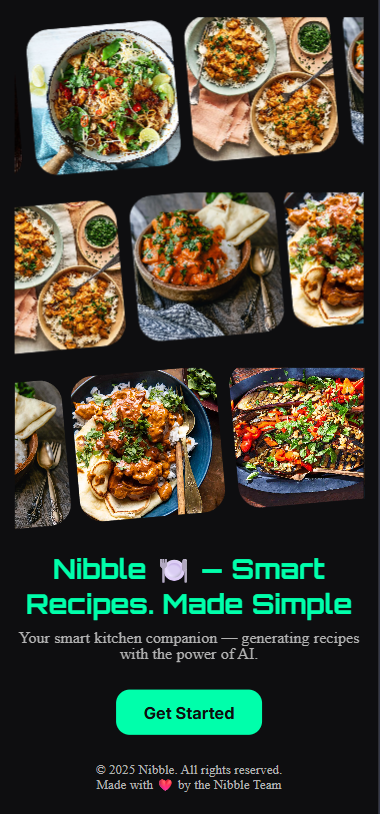
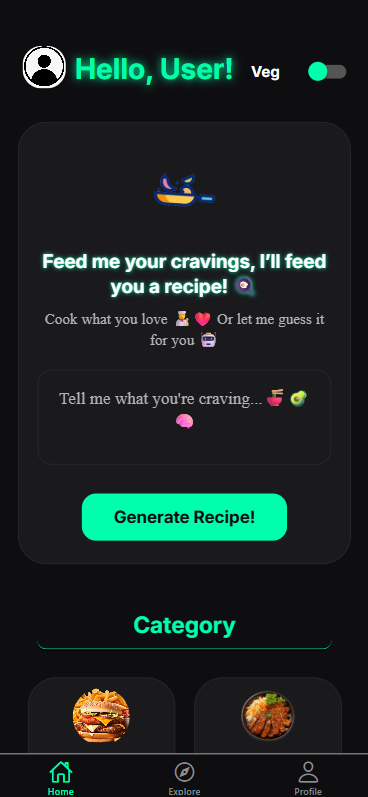
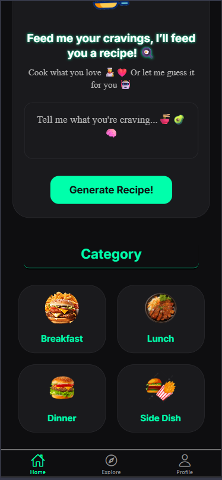
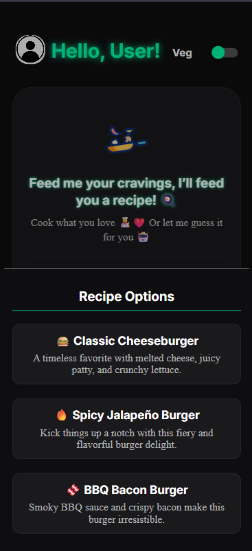
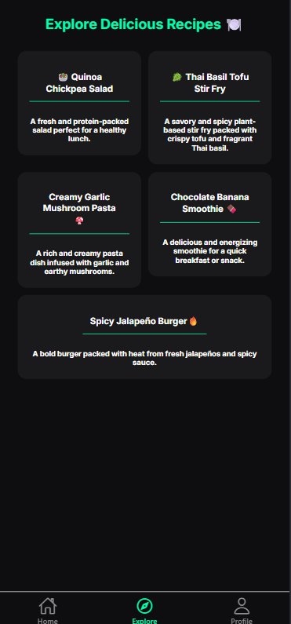
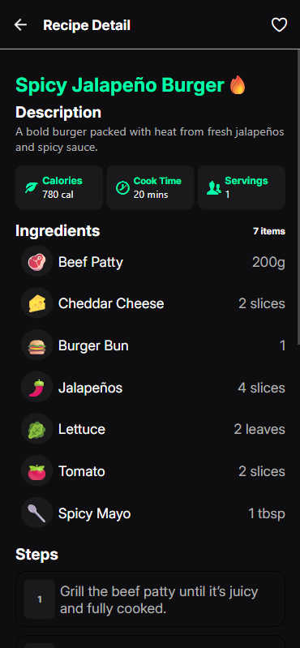
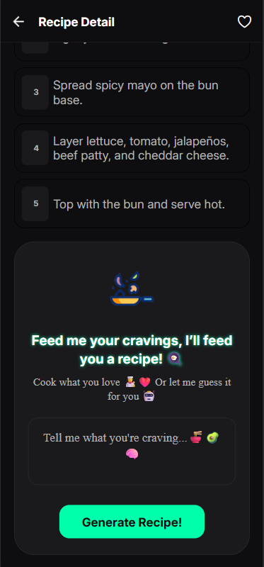
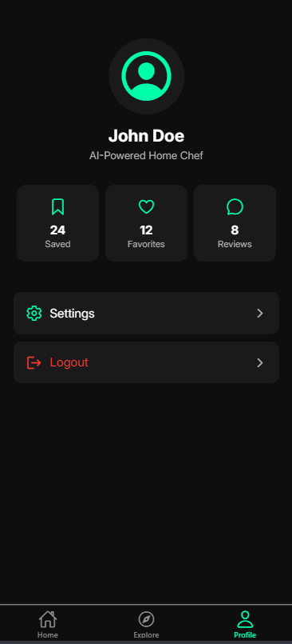

# Nibble 🍽️ — Smart Recipes. Made Simple

Nibble AI is a sleek, dark-themed AI-powered mobile app built with **React Native** and **Expo Router**. It generates creative and personalized recipes based on your choice — making meal planning smarter, faster, and more fun.



---

## 🚀 Features

- ✨ AI-generated recipe suggestions based on your input
- 📅 Build the complete database using Strapi CMS and Postgress SQL
- 📝 Full recipe details: name, description, ingredients, steps, cook time, calories, servings
- 🖤 Beautiful dark-mode design with neon highlights
- 🧾 Ingredient list with emojis
- 📄 Clean, card-based recipe detail UI
- 🔁 (Coming Soon) Carousel for recent items on the home screen
- ❤️ (Coming Soon) Add to favorites functionality

---

## 📦 Tech Stack

- **React Native** with **Expo**
- **Expo Router** for file-based navigation
- **OpenRouter API** for AI-generated recipes
- **TypeScript**
- **Custom Fonts** (Inter, Orbitron)
- **Icon Libraries**: Ionicons, Entypo

---

## 🛠️ Installation Guide

> ⚠️ Make sure you have [Node.js](https://nodejs.org/), [Git](https://git-scm.com/), and [Expo CLI](https://docs.expo.dev/get-started/installation/) installed globally.

### 1. Clone the Repository

```bash
git clone https://github.com/Sahil-SS/nibble-ai
cd nibble-ai
```

```bash
npm install
```

```bash
npm expo start
```

## 🧪 Usage

🏠 Home

- View previously generated recipes
- Carousel for recent/generated recipes (coming soon)

🔍 Explore

- Enter ingredients
- Receive 3 AI-generated recipe options

📄 Recipe Details

- **Tap on the Explore page and the on the Recipe to see ..**

* Name
* Description
* Ingredients with emojis
* Calories, Cook Time, Servings
* Step-by-step instructions

👤 Profile

- Displays user avatar and basic info
- Placeholder for future customization

## 📅 Future Upgrades

🔄 Migrate from OpenRouter API to a more stable API for consistent responses

🖼 Incorporate AI-generated images into each recipe

📚 Store previous recipes locally using SQLite or SecureStore

🎠 Home screen carousel to show recent/generated recipes

📤 Share recipe as image or link

📊 Nutritional breakdown per recipe

📡 Offline access to saved recipes

❤️ Add to favorites

## 📱 Screenshots

<p align="center">
  <figure style="display:inline-block; margin:10px">
    
    <figcaption align="center">Landing Screen</figcaption>
  </figure>
  <figure style="display:inline-block; margin:10px">
    
    <figcaption align="center">Home Page</figcaption>
  </figure>
  <figure style="display:inline-block; margin:10px">
    
    <figcaption align="center">Category Options</figcaption>
  </figure>
  <figure style="display:inline-block; margin:10px">
    
    <figcaption align="center">Generated Recipe Details</figcaption>
  </figure>
</p>

<p align="center">
  <figure style="display:inline-block; margin:10px">
    
    <figcaption align="center">Created Recipe</figcaption>
  </figure>
  <figure style="display:inline-block; margin:10px">
    
    <figcaption align="center">Complete Details</figcaption>
  </figure>
  <figure style="display:inline-block; margin:10px">
    
    <figcaption align="center">Cooking Steps</figcaption>
  </figure>
  <figure style="display:inline-block; margin:10px">
    
    <figcaption align="center">Profile Page</figcaption>
  </figure>
</p>
